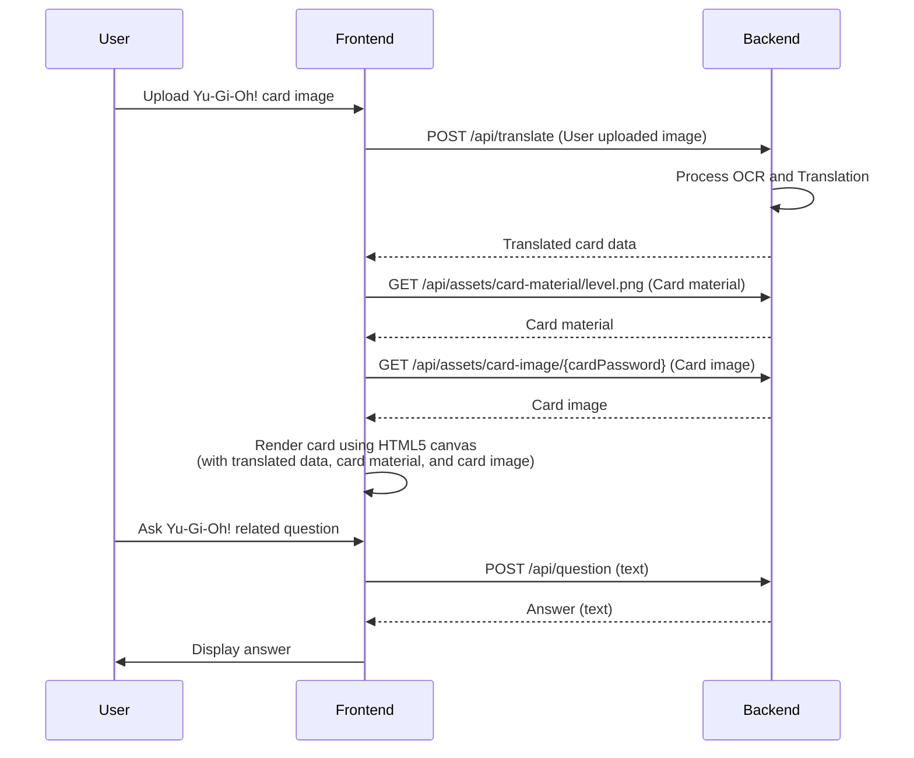

# Technical Documentation


## [▶️][0] Outline
1. **[Setup Guide][1]**
2. **[Running the Project][2]**
    1. **[Frontend][2-1]**
    2. **[Backend][2-2]**
3. **[Build][3]**
    1. **[What][3-1]**
    2. **[How][3-2]**
4. **[System Requirements Specification][4]**
    1. **[Brief][4-1]**
    2. **[Functional Requirements][4-2]**
5. **[API][5]**
    1. **[Translate API][5-1]**
    2. **[Question API][5-2]**
    3. **[Card Material API][5-3]**
    4. **[Card Image API][5-4]**
6. **[System Architecture][6]**
    1. **[Sequence Diagram][6-1]**

[0]: https://github.com/RogelioKG/Duel-Master/blob/main/doc/tech-doc.md?tab=readme-ov-file#%EF%B8%8F-outline
[1]: https://github.com/RogelioKG/Duel-Master/blob/main/doc/tech-doc.md?tab=readme-ov-file#%EF%B8%8F-setup-guide
[2]: https://github.com/RogelioKG/Duel-Master/blob/main/doc/tech-doc.md?tab=readme-ov-file#%EF%B8%8F-running-the-project
[2-1]: https://github.com/RogelioKG/Duel-Master/blob/main/doc/tech-doc.md?tab=readme-ov-file#frontend
[2-2]: https://github.com/RogelioKG/Duel-Master/blob/main/doc/tech-doc.md?tab=readme-ov-file#backend
[3]: https://github.com/RogelioKG/Duel-Master/blob/main/doc/tech-doc.md?tab=readme-ov-file#%EF%B8%8F-build
[3-1]: https://github.com/RogelioKG/Duel-Master/blob/main/doc/tech-doc.md?tab=readme-ov-file#what
[3-2]: https://github.com/RogelioKG/Duel-Master/blob/main/doc/tech-doc.md?tab=readme-ov-file#how
[4]: https://github.com/RogelioKG/Duel-Master/blob/main/doc/tech-doc.md?tab=readme-ov-file#%EF%B8%8F-system-requirements-specification
[4-1]: https://github.com/RogelioKG/Duel-Master/blob/main/doc/tech-doc.md?tab=readme-ov-file#brief
[4-2]: https://github.com/RogelioKG/Duel-Master/blob/main/doc/tech-doc.md?tab=readme-ov-file#functional-requirements
[5]: https://github.com/RogelioKG/Duel-Master/blob/main/doc/tech-doc.md?tab=readme-ov-file#%EF%B8%8F-api
[5-1]: https://github.com/RogelioKG/Duel-Master/blob/main/doc/tech-doc.md?tab=readme-ov-file#translate-api
[5-2]: https://github.com/RogelioKG/Duel-Master/blob/main/doc/tech-doc.md?tab=readme-ov-file#question-api
[5-3]: https://github.com/RogelioKG/Duel-Master/blob/main/doc/tech-doc.md?tab=readme-ov-file#card-material-api
[5-4]: https://github.com/RogelioKG/Duel-Master/blob/main/doc/tech-doc.md?tab=readme-ov-file#card-image-api
[6]: https://github.com/RogelioKG/Duel-Master/blob/main/doc/tech-doc.md?tab=readme-ov-file#%EF%B8%8F-system-architecture
[6-1]: https://github.com/RogelioKG/Duel-Master/blob/main/doc/tech-doc.md?tab=readme-ov-file#sequence-diagram

[canvas 卡片]: https://github.com/kooriookami/yugioh-card
[canvas card]: https://github.com/kooriookami/yugioh-card
[ygoprodeck API]: https://ygoprodeck.com/api-guide/


## [⬆️][0] Setup Guide

1. clone this repo
    ```
    git clone git@github.com:RogelioKG/Duel-Master.git
    ```

2. copy the contents of [yugioh-card-assets-directory] to [`backend/assets/card-material`]

    > 遊戲王卡材質包

3. copy the contents of [mt5-large-translation-for-yu-gi-oh-ja-traditional-zh] to [`backend/model`]

    > 翻譯模型 (注意：2.5 GB 左右，很胖)


## [⬆️][0] Running the Project

### Frontend

```
cd frontend
```

#### Using `npm`

1. install dependencies
    ```
    npm install
    ```

2. run (development)
    ```
    npm run dev
    ```

#### Using `pnpm`

1. install dependencies
    ```
    pnpm install
    ```

2. run (development)
    ```
    pnpm dev
    ```

### Backend

```
cd backend
```

| 📘 <span class="note">NOTE</span> |
| :--- |
| `.env` 環境變數檔 (要放在 `backend` 目錄底下) 請和[我](mailto:rogeliokg0813@gmail.com)索取！ |

#### Using `pip`
1. run

    + Windows
        ```bat
        scripts/run-backend-pip.bat
        ```

    + Linux
        ```bash
        source scripts/run-backend-pip.sh
        ```

#### Using `poetry`
1. run

    + Windows
        ```bat
        scripts/run-backend.bat
        ```

    + Linux
        ```bash
        source scripts/run-backend.sh
        ```

2. freeze the requirements
    ```
    poetry export --without-hashes --format=requirements.txt > requirements.txt
    ```

[`backend/assets/card-material`]: https://github.com/RogelioKG/Duel-Master/tree/main/backend/assets/card-material
[`backend/model`]: https://github.com/RogelioKG/Duel-Master/tree/main/backend/model
[yugioh-card-assets-directory]: https://github.com/kooriookami/yugioh-card/tree/master/src/assets/yugioh-card
[mt5-large-translation-for-yu-gi-oh-ja-traditional-zh]: https://huggingface.co/plutokokoa/mt5-large-translation-for-yu-gi-oh-ja-traditional-zh/tree/main


## [⬆️][0] Build

### What

前端程式碼可以打包成只有純 HTML / CSS / JS 的檔案，\
打包後的檔案，會產生在 `dist` 這個目錄裡，這包東西通常才是真正在部署環境上運行的東西。\
(我們的話會在 `frontend/dist` 這個目錄，下面會教你怎麼打包)

```
dist/
├── assets/
│   ├── fonts/
│   ├── videos/
│   ├── index.js
│   ├── index.css
│   └── ...
├── favicon.ico
└── index.html
```

### How

執行 `build` 指令後，所有前端程式碼，就會打包到 dist 目錄裡。

#### Using `npm`
```
npm run build
```

#### Using `pnpm`
```
pnpm build
```


## [⬆️][0] System Requirements Specification

### Brief
Duel Master 是一個 AI 驅動的聊天室，使用者可以上傳遊戲王卡片圖片，翻譯結果將以 HTML5 canvas 呈現為卡片。

Duel Master is an AI-powered chatroom where users provide Yu-Gi-Oh! card images, and the translation results are rendered as a card using HTML5 canvas.

### Functional Requirements

#### 聊天室 (Chatroom)
  - 🟢 歷史紀錄功能 (History)
    - 前端：聊天室可以開啟很多個對話，每個對話都保留問答訊息。\
      Frontend: The chatroom can open multiple conversations, each containing question-answer messages.

#### 翻譯模式 (Translation mode)
  - 🟢 翻譯功能 (Translation)
    - 前端：可上傳有卡片的圖片內容。\
      Frontend: Can upload images containing Yu-Gi-Oh! cards.
    - 後端：進行翻譯回傳翻譯結果\
      Backend: Returns the translation results.

  - 🟢 卡片顯示功能 (Card Display)
    - 前端：以 [canvas 卡片]呈現翻譯結果。\
    Frontend: The translation results are rendered as a card using HTML5 canvas ([canvas card]).
    
  - 🟢 詳細資訊功能 (Detailed Information)
    - 前端：可給定卡片密碼，並使用 [ygoprodeck API] 抓取卡片詳細資訊，用於 [canvas 卡片]。\
    Frontend: Can provide a password and fetch additional details from the [ygoprodeck API] for display on the canvas card.

#### 問答模式 (Q&A mode)
  - 🟠 問答功能 (Questions and Answers) (🚨功能尚未完成)
    - 前端：可輸入遊戲王相關提問內容。\
      Frontend: Can enter Yu-Gi-Oh! related questions.
    - 後端：回傳解惑結果。\
      Backend: Returns answers to the questions.


## [⬆️][0] API

### Translate API

  提供翻譯功能的後端 API。使用者上傳圖片，後端 API 須回傳翻譯結果。\
  This is the backend API that provides translation functionality. Users upload an image, and the backend API returns the translated results.

  ```ini
  [API]: /api/translate
  [HTTP Method]: POST
  [Request Headers]:
    {
      "Content-Type": "multipart/form-data",
    }
  [Request Parameters]:
    {
      "image": formData
    }
  [Response Headers]:
    {
      "Content-Type": "application/json",
    }
  [Response Body (Success)]:
    {
      "success": true,
      "frontCardData": {
        "name": "灰流麗",
        "attribute": "fire",
        "level": 3,
        "monsterType": "不死族",
        "atk": 0,
        "def": 1800,
        "description": "「灰流麗」的效果...",
      },
    }
  [Response Body (Failure)]:
    {
      "success": false,
      "errMessage": "(翻譯過程出錯)",
    }
  ```
### Question API

  提供問答功能的後端 API。使用者提問，後端需回傳解惑結果 (🚨功能尚未完成)。\
  This is the backend API that provides Q&A functionality. Users ask questions, and the backend returns answers (🚨 Feature not completed yet).

  ```ini
  [API]: /api/question
  [HTTP Method]: POST
  [Request Headers]:
    {
      "Content-Type": "text/plain",
    }
  [Request Body]:
    text
  [Response Headers]:
    {
      "Content-Type": "application/json",
    }
  [Response Body (Success)]:
    {
      "success": true,
      "answer": "(問答結果)",
    }
  [Response Body (Failure)]:
    {
      "success": false,
      "errMessage": "(問答過程出錯)",
    }
  ```

### Card Material API
  提供卡片材質的後端 API。前端進行 canvas 卡片渲染，因此後端要提供所需的卡片材質。\
  This is the backend API that provides card materials. The frontend renders canvas cards, so the backend needs to provide the necessary card materials.

  ```ini
  [API]: /api/assets/card-material
  [HTTP Method]: GET
  [Request URL]:
    Append the resource path to the URL. For example:
    /api/assets/card-material/yugioh/image/level.png
  [Response Headers]:
    {
      "Content-Type": "image/png",
    }
  [Response Body]:
    card material
  ```

### Card Image API
  提供卡面圖片的後端 API。前端進行 canvas 卡片渲染，因此後端要提供所需的卡面圖片。\
  This is the backend API that provides card images. The frontend renders canvas cards, so the backend needs to provide the necessary card images.

  ```ini
  [API]: /api/assets/card-image
  [HTTP Method]: GET
  [Request URL]:
    Append the card password to the URL. For example:
    /api/assets/card-image/14558127
  [Response Headers]:
    {
      "Content-Type": "image/jpeg",
    }
  [Response Body]:
    card image
  ```


## [⬆️][0] System Architecture

### Sequence Diagram


